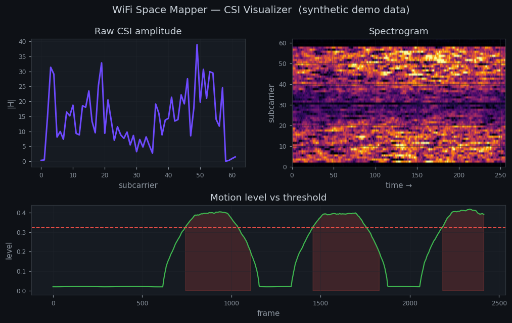
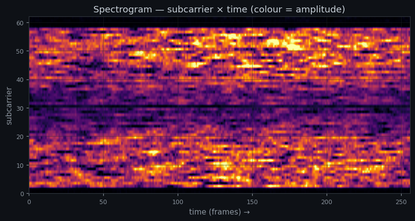
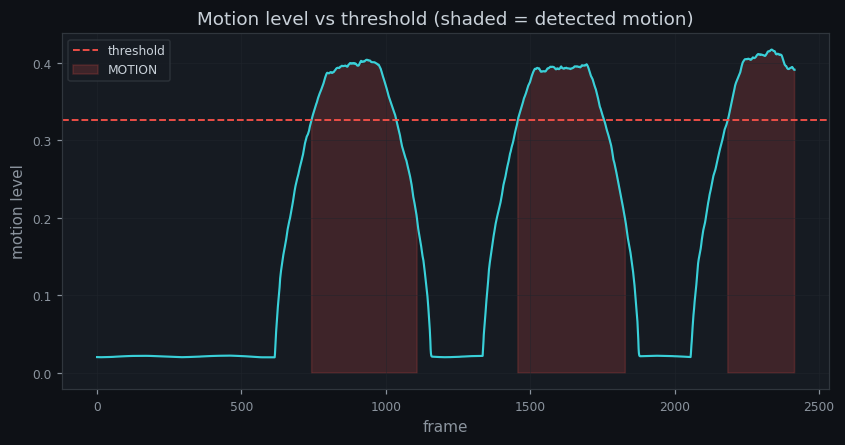
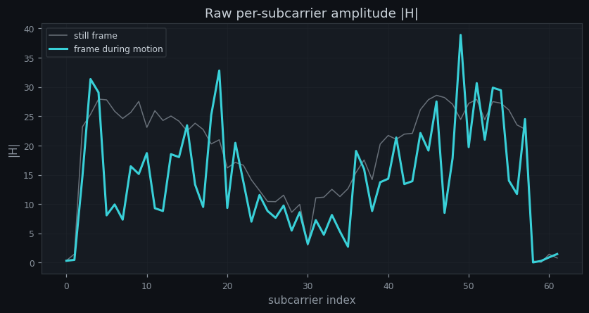
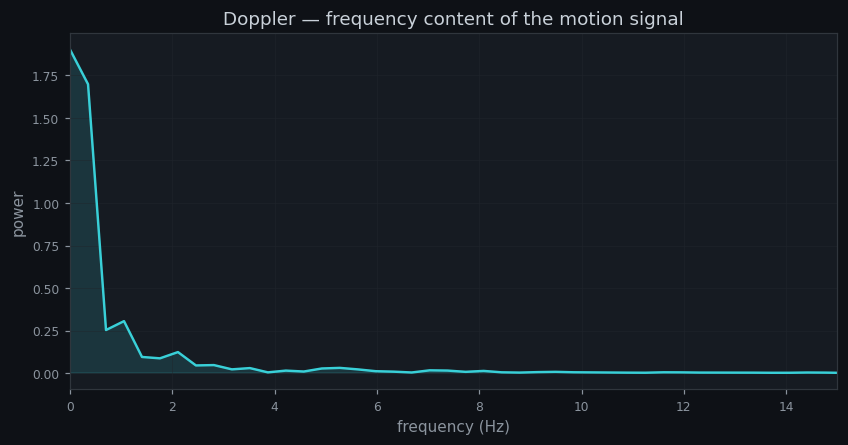
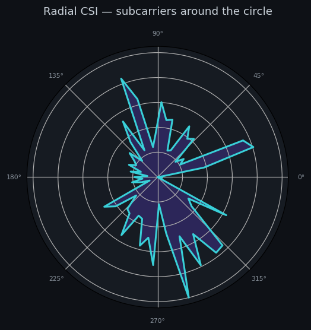

# WiFi Space Mapper

> **Device-free motion sensing from Wi-Fi radio reflections — on a commodity ESP32, built from scratch.**


A single ~$5 ESP32 turned into a **passive presence/motion sensor**. It reads the
**Channel State Information (CSI)** of ordinary Wi-Fi frames and detects when a
person moves through a room from how their body perturbs the signal's multipath —
**no camera, no PIR, no wearable.** Just how the radio waves bounce.

The whole capture stack is written **from scratch on ESP-IDF** — calling the
`esp_wifi` CSI API directly rather than wiring up a CSI library — because the goal
was to actually understand the RF + DSP pipeline end to end, not to drive a black box.
On the host, a **real-time PyQtGraph visualizer** shows the channel move six different
ways and runs the motion detector live.

---

## ✨ The Visualizer



A modern, dark, tabbed desktop app (PyQtGraph + PySide6) on a single shared streaming
engine. **It runs with no hardware** — `--demo` feeds it believable synthetic CSI — so
you can try the whole thing in one command:

```bash
pip install -r requirements.txt
python tools/wifi_visualizer.py            # demo mode (synthetic, no board)
```

> _The images below are rendered from the synthetic source by `tools/make_previews.py`
> — representative of each view, but not screenshots of the live GUI. See
> [`docs/VISUALIZER.md`](docs/VISUALIZER.md) for the full user guide._

| | |
|---|---|
| **Spectrogram** — scrolling waterfall (subcarrier × time). Still → smooth streaks; motion → the texture churns. <br>  | **Motion** — the detector: level vs calibrated threshold, shaded when motion is detected. <br>  |
| **Raw CSI** — per-subcarrier amplitude `\|H\|`; the still vs moving frames differ. <br>  | **Doppler** — FFT of the motion signal; a peak at ~0.5–10 Hz is human motion. <br>  |
| **Radar** — subcarriers around a circle, amplitude = radius; a living "flower." <br>  | **Dashboard** — all of the above at a glance, with a big MOTION/STILL banner. *(top of page)* |

Plus a **Raw CSI I/Q constellation**, a live telemetry bar (fps · RSSI · subcarriers ·
state), **Pause**, and **Recalibrate**.

---

## TL;DR

| Layer | What it does |
|-------|--------------|
| **Firmware** (C / ESP-IDF) | Connects as a Wi-Fi station, enables CSI capture, **self-pings the gateway ~100×/s** to force a dense, regular frame stream, and prints each frame as CSV over a **921600-baud** serial link. |
| **Engine** (Python) | One `csi_stream` source abstraction — live serial, replay of a recording, or synthetic — behind a threaded reader, feeding clean amplitude frames to everything else. |
| **Detector** (Python) | Real-time DSP: amplitude → **gain removal** → **moving-window variance** → **still-calibrated adaptive threshold** → **hysteresis** → live **MOTION / STILL**. |
| **Visualizer** (Python) | PyQtGraph/PySide6 dashboard: spectrogram, raw CSI, I/Q, radar, Doppler, and the detector — all live. |
| **Result** | ~87 CSI frames/s on a single antenna; cleanly separates a still room from a person walking through the link *(working proof-of-concept).* |

---

## Quick start

```bash
pip install -r requirements.txt
```

```bash
# Full dashboard
python tools/wifi_visualizer.py                 # demo: synthetic data, no board
python tools/wifi_visualizer.py COM9 921600     # live ESP32 (use your COM port)
python tools/wifi_visualizer.py path/to/take.npz # replay a recorded capture

# Or the minimal matplotlib viewer (numpy + matplotlib only)
python tools/live_csi_plot.py                   # also supports --demo / COMx baud
```

On Windows, double-click **`run_visualizer.bat`** (demo by default; pass a port to go live).

> **Live mode:** close the ESP-IDF serial monitor first (only one program can hold the
> port). Opening the port resets the board — expect a few seconds of boot + reconnect
> before frames. Find your port in Device Manager → *Ports (COM & LPT)* → *Silicon Labs
> CP210x*.

---

## Why it's non-trivial — engineering highlights

This project is small in line count but dense in the kind of problems that don't
show up until you build the real thing:

- **CSI capture from first principles.** The entire capture is three driver calls
  (`esp_wifi_set_csi_config` / `_rx_cb` / `_csi(true)`) plus a callback that ships
  the raw I/Q buffer over serial. No vendor sensing SDK.

- **The *frequency* problem (data rate).** A connected Wi-Fi station only *receives*
  the router's beacons — roughly 10/s, irregularly spaced — and CSI only fires on
  received frames. That's far too sparse to compute a stable moving variance on.
  **Fix:** a self-ping traffic generator — the board pings its gateway on a tight
  interval, and every echo *reply* is a frame that traversed the room's multipath,
  firing the CSI callback. A serial-baud bump to 921600 keeps the dense stream from
  bottlenecking on the cable. Took the rate from ~7–10 fps to a *regular* ~23 fps.

- **Throughput optimization — 4× more (data-rate).** Profiling the raw buffer
  revealed each packet carried **three redundant LTF blocks** (Legacy + 2× HT) —
  the same channel measured three times. Capturing only the Legacy LTF cut the
  payload 3× *and* made every frame a uniform 64 subcarriers (so the host could
  drop its frame-type-locking logic). With that headroom, tightening the ping
  interval to 10 ms lifted the stream from ~23 to **~87 fps** — measured, stable,
  and still well under the serial ceiling. (A telling result: the LTF cut alone
  didn't change fps, because the link was never the bottleneck — it raised the
  *ceiling* that the ping-rate change then pushed against.)

- **The *accuracy* problem (AGC).** The ESP32 re-adjusts its receive gain per packet,
  so the whole amplitude vector jumps for reasons unrelated to motion — the #1 reason
  naive CSI variance detectors fail. **Fix:** per-frame **gain removal**
  (divide by the frame mean) keeps only the channel *shape*, so gain wobble stops
  looking like motion. Motion is then measured as how much that shape *churns* over a
  sliding window — not a single frame-to-frame diff.

- **A threshold that can't cheat.** The detector learns the "still" noise floor during
  a short calibration window and **fixes** the threshold from it (P95 × 1.4), so a
  continuously moving target can't drag the threshold up to meet it. A hysteresis
  state machine (separate enter/exit levels) keeps the readout from flickering.

- **Rate-independent by design.** The detector's window and calibration are defined in
  *seconds*, then converted to frame counts from the frame rate it measures live at
  startup. So the same code behaves identically at 22 fps or 87 fps — change the capture
  rate and the detector's time constants don't silently shift underneath it. Measuring
  that rate honestly meant working around two hardware realities: the sparse
  Wi-Fi-reconnect ramp right after boot, and the ~16 ms *bursting* of USB-serial
  delivery, which makes any short-window rate estimate lie. The fix: wait until the
  stream is genuinely up, then count frames over a multi-second window.

- **One engine, three sources.** The host is split into a `csi_stream` engine (serial /
  replay / synthetic, threaded so the UI never blocks), a reusable `MotionDetector`, and
  the visualizer on top. The synthetic source means the entire app — and a headless
  self-test — runs with no board attached.

---

## How it works

```
        2.4 GHz Wi-Fi                      USB serial (CSV @ 921600)
 ┌────────┐   ⇄   ┌─────────────┐   ────────────────────────────────►   ┌──────────────┐
 │ Router │  ⇄⇄⇄  │   ESP32     │   CSI_DATA,<len>,<rssi>,[I,Q,I,Q…]     │  Python host │
 └────────┘   ⇄   │  self-ping  │                                       │  engine+UI   │
   reflections     └─────────────┘                                       └──────────────┘
   off the room   measures CSI on
   + the person   every RX frame

 Host pipeline:
   raw I/Q ─► |H| = √(I²+Q²) ─► gain removal (÷ mean) ─► moving-window std
           ─► P95 still-baseline threshold ─► hysteresis ─► MOTION / STILL
```

---

## The signal — what CSI actually is

Wi-Fi (802.11n, 20 MHz) splits the channel into **64 OFDM subcarriers** — narrow
frequency slices. For every received frame, the radio estimates the **channel
response `H`** on each subcarrier by comparing the known training preamble against
what actually arrived. `H` is a complex number per subcarrier:

- **magnitude** `|H| = √(I² + Q²)` — how much that frequency was attenuated,
- **phase** `∠H = atan2(Q, I)` — how much it was delayed.

The ESP32 hands this back as interleaved signed `(imag, real)` byte pairs. A person
moving changes the reflections in the room, which changes these per-subcarrier
magnitudes — that's the whole physical basis of the sensor. (This project uses
**amplitude** for detection; phase is noisier on a single radio without clock-sync
tricks. The visualizer still plots the raw I/Q so you can see the complex channel.)

**A detail you only learn by looking at the bytes:** with all training fields
enabled, each packet returns **192 values = 3 × 64** — the same channel measured
three times (Legacy LTF + two HT LTFs). Profiling the raw buffer made the structure
obvious: three repeating 64-bin blocks, each with a DC spike, two data sidebands, and
a run of zero-amplitude **guard subcarriers** at the band edges. Recognising that
redundancy is what enabled the 4× throughput win (capture one block, not three).

---

## The detector, step by step

The host runs a small real-time pipeline ([`tools/detector.py`](tools/detector.py)).
Each stage exists to defeat a specific way the naive "threshold the variance" approach
fails:

1. **Amplitude** — `|H|` per subcarrier from the I/Q pairs.
2. **Gain removal** — divide the frame by its own mean. Cancels the ESP32's per-packet
   AGC, which otherwise scales the whole vector and masquerades as motion.
3. **Moving-window std** — over a ~2 s window, measure how much each subcarrier's
   normalized amplitude *churns*. Still room → near-flat → low; motion → high. (A
   window, not a frame-to-frame diff, so it reflects sustained change.)
4. **Calibrated threshold** — at startup, learn the quiet baseline for ~8 s and fix the
   threshold at `P95(baseline) × 1.4`. Fixing it means continuous motion can't drag it
   upward to meet itself.
5. **Hysteresis** — separate enter/exit levels so the MOTION/STILL readout doesn't
   chatter on the boundary.

All windows are expressed in **seconds** and scaled by the measured frame rate, so the
behaviour is identical across capture rates.

---

## Hardware

- **1× ESP32-WROOM-32** (CP2102 USB-UART) — classic dual-core ESP32, native Wi-Fi CSI.
- **A 2.4 GHz Wi-Fi router** as the ambient signal source (no router modification).
- A Windows/macOS/Linux host for the Python viewer.

---

## Build & flash the firmware

Requires **ESP-IDF v5.5.x** (developed on v5.5.4; also builds on v5.3.x — only stock
`esp_wifi` / CSI / `esp_netif` APIs are used, stable across the 5.x line).

**First time:** copy `main/secrets.example.h` → `main/secrets.h` and fill in your
2.4 GHz Wi-Fi SSID/password (`secrets.h` is gitignored, so credentials never get
committed).

On Windows, double-click **`idf-shell.bat`** for an ESP-IDF-activated shell already in
the project folder, then:

```bash
idf.py set-target esp32
idf.py -p COMx flash monitor       # COMx = your board's port
```

On success the serial log shows `got ip: …` then `gateway ping started` and a stream
of `CSI_DATA,…` lines. Then close the monitor and run the visualizer (above).

---

## Results

Measured on a single ESP32 in a home room:

- **Frame rate:** ~87 CSI frames/s steady-state (single Legacy-LTF capture + 10 ms
  self-ping), up from ~23 fps — itself ~3× the beacon-only baseline.
- **Separation:** at ~100 fps the still-room motion level sits ≈ 0.03–0.07 against a
  threshold ≈ 0.10, with **zero false positives** over a still baseline run.
- **Detection:** a person walking through the link pushes the level well above the
  threshold and flips the state to MOTION.
- **Rate-independent:** the same detector calibrates and behaves consistently whether
  the board streams 22 or ~100 fps (windows scale with the measured rate).

It is an honest **proof-of-concept**: detection is reliable once calibrated for a given
room/geometry, and degrades if the environment or link changes after calibration. The
roadmap below is about hardening that.

---

## Scope & the physics that draws the lines

A single-antenna ESP32 on a 20 MHz channel has a range resolution of
`c / (2 × bandwidth) ≈ 7.5 m` and **no angle-of-arrival**, so it physically *cannot*
reconstruct a LiDAR-style floorplan of walls and furniture — that's a wave limit, not
a code limit. The realistic target is a **motion / occupancy** signal (and, with 3–4
nodes, a coarse heatmap of *where* activity is), not room geometry.

| Goal | Feasible on 1 board? |
|------|----------------------|
| Presence / motion detection | ✅ yes — *this project* |
| Activity discrimination (still / walking) | ✅ light feature work |
| Coarse localization (*where* the motion is) | 🟡 needs 3–4 nodes |
| Wall/furniture floorplan | 🔴 research-grade (SDR / antenna arrays) |

---

## Roadmap

- [x] **Rung 0** — stream CSI, live-plot subcarrier amplitude, react to a hand wave.
- [x] **Frequency pass** — self-ping + 921600 baud → dense, regular ~23 fps stream.
- [x] **Throughput optimization** — single Legacy-LTF capture (3× smaller, uniform
      frames) + 10 ms ping → ~87 fps.
- [x] **Rung 1 (PoC)** — gain-removal + moving-variance + calibrated-threshold detector.
- [x] **Rate-independent detector** — seconds-based windows scaled by the measured fps.
- [x] **Visualizer** — PyQtGraph/PySide6 dashboard (spectrogram, raw CSI, I/Q, radar,
      Doppler, motion) on a shared `csi_stream` engine, with a synthetic demo mode.
- [ ] **Robustness** — subcarrier selection (drop guard/DC), Hampel outlier filter,
      CV-based turbulence, P95 hysteresis hardening for cross-room generalization.
- [ ] **On-device gain lock** — ESPectre-style AGC/FFT gain locking in firmware, so the
      raw σ becomes a clean motion signal and detection can run on the ESP32 itself.
- [ ] **Rung 2** — activity discrimination (empty / still / walking) via a classifier.
- [ ] **Rung 3 (stretch)** — 3–4 nodes → coarse 2D motion heatmap.

---

## Repository layout

```
main/main.c             from-scratch firmware: STA connect → CSI capture → self-ping → CSV
main/secrets.example.h  Wi-Fi credential template (copy to secrets.h)
sdkconfig.defaults      CSI enabled + 921600 console baud (tracked build config)
idf-shell.bat           one-click ESP-IDF-activated shell (works on both dev machines)

tools/csi_stream.py     host engine: Serial / Replay / Synthetic sources + threaded reader
tools/detector.py       the proven motion detector as a reusable class
tools/wifi_visualizer.py  PyQtGraph + PySide6 real-time dashboard (the headline app)
tools/live_csi_plot.py  minimal matplotlib viewer + detector (numpy/matplotlib only)
tools/record_csi.py     labeled walk-segment recorder (for the person-ID work)
tools/selftest_csi.py   headless engine + detector self-test (no hardware)
tools/make_previews.py  regenerates the docs/media preview images from synthetic data
run_visualizer.bat      one-click launcher for the visualizer (demo by default)
requirements.txt        host Python dependencies
docs/VISUALIZER.md      full visualizer user guide
CHANGELOG.md            staged, hardware-verified build history
```

---

## Tech stack

**Embedded C** · **ESP-IDF v5.5** · **FreeRTOS** · **Wi-Fi CSI / 802.11 PHY** ·
**lwIP** (ICMP self-ping) · **Python** (NumPy, **PyQtGraph + PySide6**, Matplotlib,
pySerial) · **real-time DSP** (gain normalization, moving-window variance, adaptive
thresholding, hysteresis, FFT).

*Built incrementally in hardware-verified stages — see [`CHANGELOG.md`](CHANGELOG.md).*
